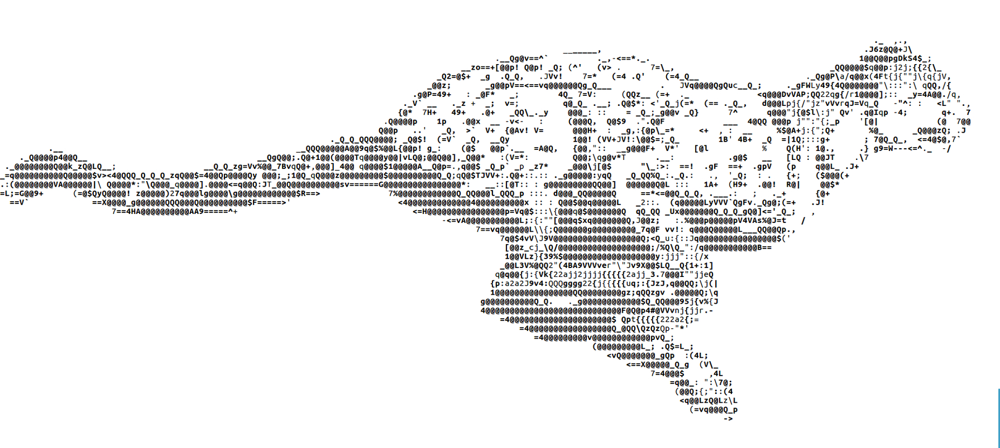

&nbsp;

Cheetah is a machine-learning repository containing counter-misinformation methods and results for reproduction.
Techniques graduate here from other data-extraction and algorithmic projects. While this repro
contains algorithms and code, its intent is not as a library but to provide a self-contained repro environment for academic research and dissemination.

By the way, to my knowledge I am still the sole and ONLY machine learning developer or security researcher in this space, a very fertile one for research.
I have a fulltime job and am very resource limited, so I do what I can. However the adversaries in this field are working overtime, often with millions in state, hedgefund, and corporate backing.
I know because I have personally turned down multiple groups down for employment, and will continue to do so.

Please star this project and consider supporting via paypal or other means. Good luck, we're all counting on you.

## Running Cheetah

Cheetah is simple to run. Cd into src/ and run main.py with python3:

* cd src/
* python3 main.py

The main menu will present various options.
The first task is to download the FastText english term-vector model from Facebook research to the 
models/english/ directory. I provided a tool to do this, or you may manually download the '.text' vector model via the website:
* https://fasttext.cc/docs/en/crawl-vectors.html
* --> english -> '.text' -> downloaded file is named "cc.en.300.vec.gz"
* NOTE: Don't download the .bin model! Get the .text model
* Unzip the model and place it at models/english/cc.en.300.vec.gz

Once downloaded, select 'cheetah repro' from the main menu options and let it complete. The 
calculations take a few minutes to complete on a modest machine.

Requirements:
* Python 3.5+

Non-standard packages:
* matplotlib
* numpy
* gensim
* unidecode (I think this module is non-standard)

To install these packages, use:
* pip install -r requirements.txt

Python dependencies are what they are, so fight your environment as needed to get these installed consistently.

I apologize because I want this to be as self-contained as possible, but there may be other required
python packages I am missing. If you see exceptions having to do with missing packages, just install
them individually with pip3 and retry:

	pip3 install --user [package name]

