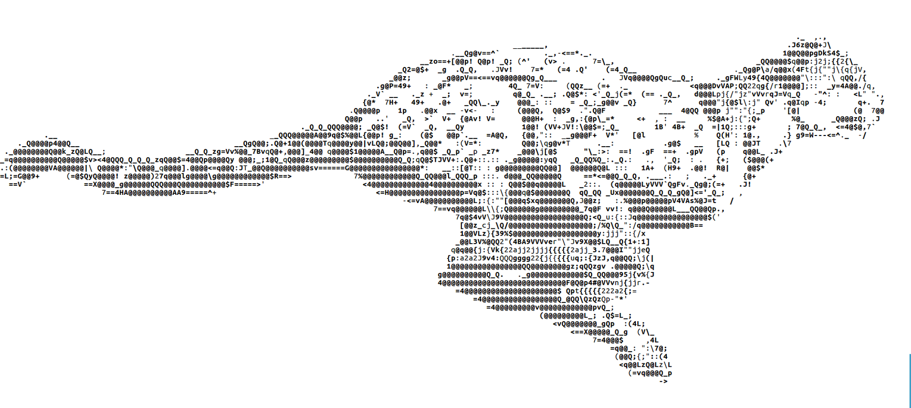
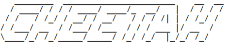

&nbsp;

Tired of unrelenting fake news? Skeptical of misinformation claims made by tinpot 'experts' [actively engaging in it](https://www.nytimes.com/2018/12/19/us/alabama-senate-roy-jones-russia.html)?
Worried about the unprecedented encroachment on public discourse by a tiny handful of regionally and politically isolated tech interests?

Have no fear, Cheetah is here!

Cheetah is a machine-learning repository containing counter-misinformation methods and results for reproduction.
Techniques graduate here from other data-extraction and algorithmic projects. While this repro
contains algorithms and code, its intent is not as a library but to provide a self-contained repro environment for research and dissemination.

Personal note: I once developed [open-source](https://github.com/niceyeti/SLIDE) AAC services and algorithms for patients with neurodegenerative disorders.
One day in grad school I got curious about applying those same NLP techniques to analyze misinformation, and discovered the industry I aspired to work for did not share those values
of personal autonomy and freedom. Very much the opposite.

To the best of my knowledge, I am the sole public machine learning developer or security researcher in this space, a very fertile one for research.
However, I am also a fulltime engineer and resource-limited, so I can only do what I can.
By contrast, the adversaries in this field are working overtime against centuries of democratic norms, backed by millions in state, hedgefund, and corporate funding.
In sec-speak, they exploit the weak or non-existent repudiation properties of digital and social media to monitor, to influence, and to interfere.
The purpose of this project is to inform and educate the public about this new public nuisance, using open-source methods to quantify it.
Because the reality is that it is actually very easy to do--for some reason, researchers just don't do it.

Please star this project and consider supporting via paypal or other means.

## Running Cheetah

Cheetah is simple to run. Cd into src/ and run main.py with python:

* cd src/
* python3 main.py

The main menu will present various options.
The first task is to download the FastText english term-vector model from Facebook research to the 
models/english/ directory. I provided a tool to do this, or you may manually download the '.text' vector model via the website:
* https://fasttext.cc/docs/en/crawl-vectors.html
* --> english -> '.text' -> downloaded file is named "cc.en.300.vec.gz"
* **NOTE: do not download the .bin model**, get the much smaller ".text" model.
* Unzip the model and place it at models/english/cc.en.300.vec.gz

Once downloaded, select 'cheetah repro' from the main menu options and let it complete. The 
calculations take a few minutes to complete on a modest machine.

## Requirements

* Python 3.5+

Non-standard packages:
* matplotlib
* numpy
* gensim
* unidecode (I think this module is non-standard)

To install these packages, use:
* pip install -r requirements.txt

Python dependencies are what they are, so fight your environment as needed to get these installed consistently.

I apologize because I want this to be as self-contained as possible, but there may be other required
python packages I am missing. If you see exceptions having to do with missing packages, just install
them individually with pip3 and retry:

	pip3 install --user [package name]

Dockerizing Cheetah is in progress.

